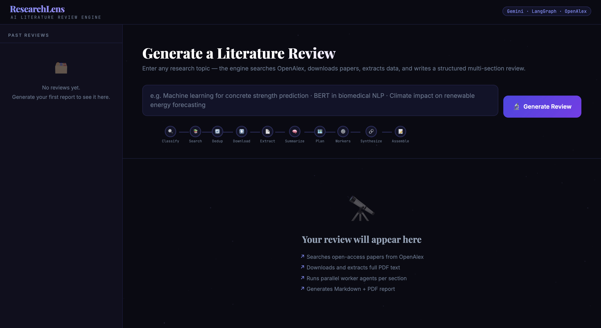

# ResearchLens — Multi-Agent Literature Review System

A LangGraph-based multi-agent pipeline that turns a research topic into a full literature review — automatically searching, downloading, reading, and synthesizing academic papers — wrapped in a Flask web app with live progress streaming, history tracking, and Markdown/PDF export.

> Type a topic → watch the agents search, fetch, and read papers in real time → get a publication-style literature review as Markdown or PDF.

<p align="center">
  
</p>

*(Full pipeline run takes 3–10 minutes depending on topic breadth and paper availability. See [Performance](#performance--bottlenecks) below for where the time actually goes.)*

---

## Table of Contents

- [What it does](#what-it-does)
- [Architecture](#architecture)
- [Tech stack](#tech-stack)
- [Screenshots](#screenshots)
- [Setup](#setup)
- [How the async pipeline works](#how-the-async-pipeline-works)
- [Performance / bottlenecks](#performance--bottlenecks)
- [Known limitations & what I'd change for production](#known-limitations--what-id-change-for-production)
- [Project structure](#project-structure)

---

## What it does

Give it a research topic, and ResearchLens will:

1. Classify and route the query (research request vs. casual chat)
2. Search **OpenAlex** for relevant papers and de-duplicate results
3. Download available PDFs and extract their full text
4. Plan a review structure using an LLM **planner agent**
5. Fan the work out to parallel **worker agents**, each comparing methods, datasets, results, and gaps across papers
6. Summarize each paper individually
7. **Synthesize** everything into a single, coherent, publication-style literature review
8. Assemble the final report and make it available as Markdown or PDF, with a full run history

All of this is orchestrated as a stateful multi-agent graph in **LangGraph**, not a single prompt-and-response call.

## Architecture

```
User submits topic (POST /api/start)
        │
        ▼
 job_id created → saved to SQLite (status: running)
        │
        ▼
 Background thread spawned to run the LangGraph pipeline
        │
        ├── query_classifier_node
        ├── research_papers_node  (OpenAlex search)
        ├── de_duplicate_papers
        ├── pdf_downloader_node   (retry + backoff)
        ├── pdf_extractor_node
        ├── planner_node          (LLM: plans review structure)
        ├── dispatch_workers      (parallel LLM workers)
        │     └── worker_node × N (per-paper analysis)
        ├── paper_summary_node
        ├── synthesizer_node      (LLM: merges everything)
        └── assembler_node        (final report)
        │
        ▼
 Progress pushed live via a per-job Queue → streamed to browser over SSE
        │
        ▼
 Final Markdown saved → converted to PDF (WeasyPrint) → SQLite updated (status: done)
```

The Flask layer doesn't run the pipeline inline — it kicks off a background thread per job and immediately returns a `job_id`, then streams progress to the browser separately. This is what makes a 3–10 minute job usable from a web UI without the request timing out. Full breakdown in [How the async pipeline works](#how-the-async-pipeline-works).

## Tech stack

| Layer | Technology |
|---|---|
| Agent orchestration | LangGraph |
| LLM | Google Gemini (via `langchain-google-genai`) |
| Paper discovery | OpenAlex API |
| PDF parsing | PyMuPDF |
| Backend | Flask |
| Live progress | Server-Sent Events (SSE) |
| Persistence | SQLite (run history + job status) |
| PDF export | Markdown → WeasyPrint |
| Frontend | Vanilla HTML/CSS/JS (no framework) |

## Screenshots

| Input | Live Progress | Final Report |
|---|---|---|
|  |  |  |

## Setup

### 1. Install dependencies

```bash
pip install -r requirements.txt
```

> WeasyPrint needs a few system libraries for PDF export:
> - **Ubuntu/Debian:** `sudo apt install libpango-1.0-0 libcairo2 libgdk-pixbuf2.0-0`
> - **macOS:** `brew install pango cairo`
> - **Windows:** see [WeasyPrint docs](https://doc.courtbouillon.org/weasyprint/stable/first_steps.html)
>
> If it's not available, PDF export is disabled automatically and Markdown output still works.

### 2. Set your API key

Create a `.env` file in the project root:

```
GOOGLE_API_KEY=your_gemini_api_key_here
```

### 3. Run

```bash
python app.py
# or
bash run.sh
```

Then open **http://localhost:5000**.

## How the async pipeline works

A single HTTP request can't hold a connection open for 10 minutes, so the app splits "start the job" from "watch the job" into two separate flows:

1. **`POST /api/start`** — validates the topic, writes a new row to SQLite (`status='running'`), creates a `queue.Queue` for this job, and starts the pipeline in a background `threading.Thread`. It returns the `job_id` immediately — it does not wait for the pipeline to finish.
2. **`GET /api/stream/<job_id>`** — opens a **Server-Sent Events** connection. As the background thread calls `progress(msg)` at each pipeline stage, messages land on that job's queue and get streamed to the browser as they happen — no polling, no refresh.
3. When the pipeline finishes, the result is written to disk (Markdown + PDF), the SQLite row is updated to `status='done'`, and a final `done` event is pushed down the stream so the UI can show the download links.
4. **`GET /api/download/<job_id>/<fmt>`** and **`GET /api/report/<job_id>`** serve the finished files/content on demand, looked up by `job_id` from SQLite — so results persist and are viewable later from the history sidebar, not just in the original session.

## Performance / bottlenecks

The 3–10 minute runtime is dominated by two things, not the LLM calls themselves:

- **PDF downloads** from publisher sites — subject to network latency and retries (the downloader includes retry-with-backoff for flaky links)
- **Sequential OpenAlex search + de-duplication** before any LLM work can start

The actual LLM work (planning, per-paper analysis, synthesis) is partially parallelized via the worker fan-out step, but paper acquisition is currently the long pole.

## Known limitations & what I'd change for production

Being upfront about this is more useful than pretending it's production-hardened:

- **Unbounded thread-per-job** — every `/api/start` call spawns a new thread with no cap. Fine at small scale; at real concurrency I'd replace this with a bounded worker pool (`ThreadPoolExecutor`) or a real task queue (Celery + Redis) so requests queue instead of all firing at once.
- **SQLite for history** — simple and fine for a single-instance demo; a multi-instance deployment would need Postgres.
- **No auth on `/api/start`** — anyone with the URL can trigger a run (and burn API quota). A real deployment would gate this behind an API key or login.
- **Open-access papers only** — the pipeline retrieves PDFs directly from OpenAlex's open-access links; it can't pull paywalled papers behind publisher subscriptions (Elsevier, Springer, IEEE, etc.), since that would require institutional access or per-publisher API agreements. This means review coverage depends on how much open-access literature exists for a topic — strong for fields like ML/CS with heavy arXiv presence, weaker for fields where most work sits behind paywalls.
- **Ephemeral storage on most free hosting tiers** — generated PDFs/DB can be wiped on redeploy, so this is currently run locally / demoed via video rather than kept permanently live.

## Project structure

```
research_gui/
├── app.py               ← Flask server: routes, SSE streaming, SQLite, PDF export
├── main3.py             ← LangGraph pipeline (query classification → search → download →
│                           planning → parallel worker analysis → synthesis)
├── templates/
│   └── index.html       ← Single-page UI (progress log, history sidebar, report viewer)
├── outputs/              ← Generated .md and .pdf reports
├── history.db            ← SQLite run history (auto-created)
├── requirements.txt
└── run.sh
```
